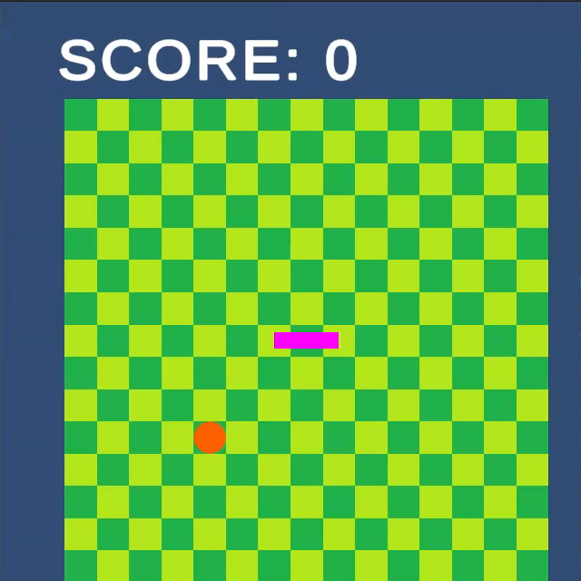

# Snake AI

AI plays Snake Game autonomously  

## Usage
1. Clone this repository
1. Setup Snake Game
    1. Click `Add` > `Add project from disk` in the UnityHub
    1. Open `SnakeGame` folder with Unity
    1. Build the game
1. Setup AI Agent
    1. Start Jupyter Server
    1. Open `snake_learn.ipynb` to train AI, or `snake_eval.ipynb` to evaluate
1. Train or Evaluate AI
    1. Run the snake game
    1. Run all the cells of `snake_learn.ipynb` or `snake_eval.ipynb`

## Game Environment
* Unity 6000.0.47f1
* UnityHub 3.12.1
* Visual Studio Code 1.99.3
* Ubuntu 22.04 LTS

## AI Environment
* Python 3.8.0
* Jupyter Notebook Server 6.5.6
* PyTorch 2.1.0a0+41361538.nv23.6
* Tensorboard 2.14.0
* NumPy 1.24.4
