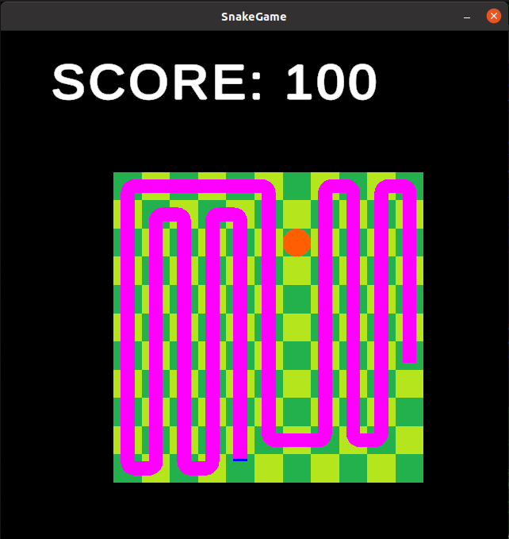

# Snake
Simple Snake Game made with Unity  
Control the snake to eat food while avoiding itself and wall  

## Features
* Control the snake by arrow keys
* Eat food to grow
* Game over when hitting itself or walls
* 3 play area sizes and 3 snake speed

## Usage
1. Clone this repository
1. Click `Add` > 'Add project from disk' in the UnityHub
1. Open the project with Unity

## Development Environment
* Unity 6000.0.47f1
* UnityHub 3.12.1
* Visual Studio Code 1.99.3
* Ubuntu 22.04 LTS

## Screenshots

